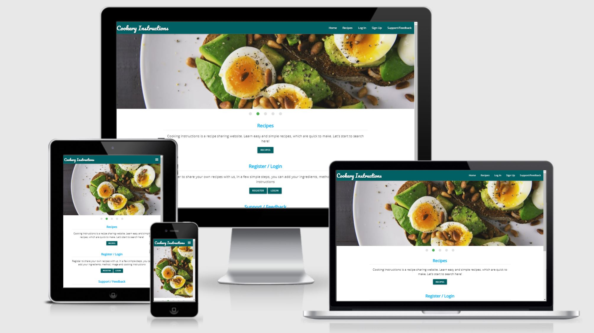

# Cookery Instructions

### An online cookery Instructions Website created by Vijayalakshmi Dhandapani.

[View live site here](http://ms3-cookery-instructions.herokuapp.com/)

# Milestone Project 3

This site is made by using **HTML**, **CSS**, **javascript**, **Python**, **MongoDB**, and **Flask Framework**. 
The purpose of this site is to show CRUD functionality and Database accessibility.
***
## Table of Content

* [Project Overview](#project-overview)

* [User Experience](#user-experience)
    
    * [User Goals](#user-goals)
    * [User Stories](#user-stories)

* [Planes of Development](#planes-of-development)
    * [Strategy](#strategy)
    * [Scope](#scope)
    * [Structure](#structure)
    * [Skeleton](#skeleton)
        * [Wireframe](#wireframe)
        * [Database Schema](#database-schema)
        * [Sitemap](#sitemap)
    * [Surface](#surface)
        * [Color](#color)
        * [Typography](#typography)
        * [Images](#images)

* [Database model](#database-model)

* [Features](#features)
    * [Features Used](#features-used)
    * [Features to be implemented in Future](#features-to-be-implemented-in-future)

* [Technologies used](#technologies-used)
    * [Tools](#tools)

* [Resources](#resources)

* [Testing](#testing)

* [Deployment](#deployment)
    * [Prerequisites](#prerequisites)
    * [How to Clone Cookery Instructions](#how-to-clone-cookery-instrucitons)
    * [How to Deploy to Heroku](#how-to-deploy-to-heroku)

* [Credits](#credits)
    * [Content](#content)
    * [Code](#code)
    * [Acknowledgments](#acknowledgments)
***

## Project Overview

The Cookery Instructions website for people who simply love cooking, or even just beginning to be interested in cooking.

People, who would like to see someone's recipes for new ideas or to share their own recipes with other people.

The purpose of this site is to serving the best recipes in simply and easily.

All the recipes are visible to all the users to they don't need to create an account if they just would like to see recipes.

If users would like to create and post their own recipes or known recipes they need to create an account. The process of creating an account is very simple.

The website is designed to be suitable for use on all devices, from mobile to desktop.

[Go back to Top](#table-of-content)
***

## User experience

### User Goals

1. As a user, I want to display and work on my site in all devices from large screen monitors, Laptops to tablets and phones.
2. As a user, I want the website to be visually simple and easy cooking recipes.
3. As a user, I want to find the recipe listing feature to be searchable, so user can search for specific recipes.
4. As a user, I want an easy login or signup to the website.
5. As a user, I want the website to be easy to add, edit or delete their own recipes.
6. As a user, I want the website that focuses on healthier choices and delicious meals.

### User Stories

1. As a user, I want to be able to easily find the favourite dishes that I am looking for.
2. As a user, I want to search the dishes by using simple words.
3. As a user, I want to select dishes by their appearance.
4. As a user, I want to know the ingredients, method and cooking instruction for specific dishes.
5. As a user, I want to contact the admin of the page if I am facing some technical issues.
6. As a user, I want to register or sign up my account and able to add their own recipes.
7. As a registered user, I want to login my account and make some changes to my recipes.
8. As a registered user, I want to login my account and add another recipes.
9. As a registered user, I want to login my account and remove my recipes.
10. As a registered user, I want to login from mobile or tablets and expect the site and image to be fully responsive.
11. As a registered user, I want to logout easily.

[Go back to Top](#table-of-content)
***

## Planes of Development
### Strategy

The aim of making this site is to make a website that has CRUD mechanism and Database access functionality.
I decided to make a cookery instructions site, which will work as a platform for peoples to learn new varieties of dishes in very simple and easy method.
People who have less experience in cooking and would just like to see recipes, they can do it simply by visiting the website where all the recipes are shown.
To see recipes, users do not need to register so it is hassle-free.
The main goal of this website is to provide a recipe platform that is easy to use.

### Scope
To achieve users goals, below are the minimum features to be included in this project.
CRUD (Create, Read, Update and Delete) functions are required for this project so these are implemented as a part of essential features.

- Simple Home page design that first time users can easily understand the purpose of the website.
- Recipes are displayed in a grid of "cards" consisting of an image and recipe title, clicking on a recipe button takes you to the recipe details page.
- All the recipes are shown on Recipes details page.
- Register page where users can create an account to create(add), post and edit their recipes.
- Login page where users can log in to the website.
- Logout function that users can log out the website.
- Profile pages where users can see all their recipes and access to create(add), edit and remove their recipes.
- Create(add) Recipe page where users can create(add) and post their recipes.
- Edit Recipe function that users can edit their recipes.
- Delete Recipe function that users can delete their recipes.
- Search by a keyword(s) function that users can search for specific recipes.
- 404 error page that appears for invalid URL and takes user back to *Home* page of the website safely.
- Users can contact the admin easily for Support or Feedback.

### Structure
- This website consists of multi-pages, where pages are connected through Navigation Bar or Python. 
- The navigation bar will have links for the Home page, Recipes, Login, Signup, and Support/Feedback form. 
- The navigation links will change and show the logout and add new recipe option Once the user is logged in. 
- The navigation bar will be collapsible for Mobile view and expand in a sidebar when clicked. 
- There will be a footer, which will show the social network. It will be sticky and always remain at the end of the page. 
- There are two forms will be there, one for Login and the other for signup. 
- The support / Feedback form will also be there for the user to contact and get support from admin.
- There will be pages for adding the new recipes and Editing the already published recipes by the users. User can also delete their recipes or post if they want. 
- Admin will have the power to delete any post if that is unsuitable for the page. 
- All the data will be stored in MongoDB and Flask framework will be used to develop the site and finally, it will be deployed by using Heroku.

### **Skeleton**
#### **Wireframe**
The wireframe for this project has been made for Three screen sizes(Laptop View, Tablet View and Mobile View).

The wireframes for this Project can be seen here.
- [Home Page](static/images/home_page.pdf)
- [Recipe Page](static/images/recipe_page.pdf)
- [Add Recipe Page](static/images/addrecipe_page.pdf)
- [Edit Recipe Page](static/images/editrecipe_page.pdf)
- [Profile Page](static/images/profile_page.pdf)
- [Login Page](static/images/login_page.pdf)
- [Sign Up Page](static/images/signup_page.pdf)
- [contact Page](static/images/contact_page.pdf)

#### **Database Schema**
The Schema is prepared for the better understanding of the Database Collection.

This Project has 3 collection. Categories, recipes and users.

Database Schema can be seen here. [Schema](static/images/database_schema.pdf)

#### **Sitemap**
Sitemap is prepared for this site to understand the navigation of the pages.

Sitemap can be seen here. [Sitemap](static/images/site_map.pdf)

### **Surface**
#### **Color**
The color theme is used from Materializecss.com. It is decided by keeping Hero image in consideration and mainly two colours cyan(#006064 ) 
and light-blue(#03a9f4) and their shades are used according to the page requirement.

**Core**

Two shades of Materialize Cyan is used as the core element of the page, namely the Navbar, Footer.

*  (cyan light)
*  (cyan darken-4)

**Cards and Forms**

Lighter shade of cyan is used as the background colour of the form and the cards.

*  (cyan light)

**Buttons**

It is important for the buttons to have consistent colour with the intuitive suggestions about their functions. 
Cyan is used for **Login**, **Register**, Contact form **submit**, **Add Recipe**, **Edit Recipe**,
**Add categories**, and **Edit category**.

Orange is used for the **Delete**, Contact form **Cancel** button, Recipe search **Undo** button.

*  (cyan)
*  (orange)

#### **Typography**

[Roboto](https://fonts.google.com/?query=roboto)
[Open Sans](https://fonts.google.com/?query=Open+Sans)
[Pacifico](https://fonts.google.com/?query=Pacifico)

These Google fonts are selected for the entire project.

#### **Images**
The images used in this project are taken by the developer and are subject of demonstration only.
The Slide Image is taken from Pexel.com. And the recipes are taken from bbcgoodfoods.com.

[Go back to Top](#table-of-content)
***

## **Database model**

MongoDB's non-relational database structure is used for this type of site as there are only a few relationships between the various collections. 

 **Recipes Collection**
 | Key               | Type     |
| -------------      |:---------|
| _id                | ObjectId |
| category_name      | string   |  
| recipe_name        | string   |
| recipe_image       | string   |
| recipe_ingredients | string   | 
| recipe_method      | string   | 
| recipe_serves      | number   | 
| recipe_time        | number   | 
| recipe_vegetarian  | string   | 
| recipe_addedby     | string   |

 **Categories Collection**
| Key           | Type      |
| ------------- |:---------:|
| _id           | ObjectId  |
| category_name | string    |

 **Users Collection**
| Key      | Type      | 
| -------- |:---------:|
| _id      | ObjectId  |
| username | string    | 
| password | string    |  

 [Go back to Top](#table-of-content)
 ***

 ## **Features**

### **Features Used**

#### *Elements on every page*

**Navigation Bar**

* [MaterializeCSS](https://materializecss.com/navbar.html) is referred for making the Navigation Bar.
* Navigation Bar is situated on the top of the page with the **Cookery Instructions** logo on left and menu items on right.
* The menu is collapsible in mobile view and opens in sidebar, in mobile view the logo is situated in the middle of the Navbar and menu items on left. 
* The Navbar menu have **Home**, **Recipes**, **Login**, **Sign up** and **Support / Feedback** link for every visitor who visits the site.
* The Navbar menu will change to **Home**, **Recipes**, **Profile**, **Add Recipe**, **Logout** and **Support / Feedback** after the user logged in.
* The **Manage categories** link is visible only to Admin of the site.

**Footer**

* The Footer is situated at the bottom of every page. Which is having Site slogan, Copyright information and links to social media like Instagram, YouTube and Facebook.
* [MaterializeCSS](https://materializecss.com/footer.html) is used to make the footer sticky at the bottom of every page, by adding code in the CSS Style sheet.

#### *Elements on different pages*

**Home Page**

* Five Slide Images are there on the Home page. It is taken from 
  [Pexel.com](https://www.pexels.com/)
* A welcome note is situated on the bottom of the slide images and Recipe button link to open recipe page.
* A Register / Login button link to open the Sign Up  or Login form page.
* A Support / Feedback button link to open support/feedback form page. 

**Recipe Page**

* A search bar is given to search on the recipes.
* Recipe cards are there as three in a row , which shows the image of the recipe and its name. It is responsive and change to 2 in a row for medium size screen and 1 in a row for small size(mobile) screen.
* The card image will open a new page when clicked the image on it. That page will have the methods of the recipes.

**Recipe Details Page**

* This page will open after click on the image on **recipe** page.
* This page has a full details methods of specific Recipes:
    1.Image of the recipe display on the right side
    2.Name of the recipe , serves, time and vegetarian will on right side.
    3.Ingredients are display on the left bottom side
    4.Methods are display on the right bottom side
    5.At the end show the username who added that recipe.
    6.At the bottom there is a button available to back to **recipe** page.
One **Edit** and One **Delete** buttons are also there on the top of the page, which is visible only to the owner of the recipe(added by) and to the Admin of the site.

**Profile Page**

* The profile page is the first page the user sees after logging in or Registering for the first time.
* This page has One Welcome note with the current user name.
* This page will show all the recipes added by the user. If the User has not added any recipe means they can add a new recipe by using  Add Recipe button will direct to the add recipe page, Where the User can add their recipe.
* Edit & Delete buttons are available to user can edit or delete their recipe.

**Add Recipe Page**

* This page contains more steps:
    1.Choose Category (dropdown)
    2.Recipe Name
    3.Image URL
    4.Ingredients
    5.Methods
    6.Serves
    7.Time(In Minutes)
    8.Vegetarian(switches)
* This form has one Add Recipe button at the end to add the recipe
* Once the recipe is added the user is directed to the recipe page.
* The Categories are:
    1.Vegetarian
    2.Non Vegetarian
    3.Desserts
* These categories can be added or removed by the Admin.
* Each input section is compulsory and is validated by adding one Materialize code in Script page. This code is provided by Code Institute.

**Edit Recipe Page**

* This page looks the same as the Add Recipe page.
* This page is directed from the View profile page, where a button is given to Edit the recipe. 
  That button is only visible to the owner of the post.
* When the owner clicks the edit button, all the fields populate with already filled data, which makes it easier to make the changes.
* 2 buttons are given at the bottom of the form. One to Edit the changes and One to Cancel any changes. 
* The **Edit Recipe** will click on the page it displays a flash message of " Recipe Updated".
* The **Cancel button** will bring the user to the recipe page.

**Delete Recipe**

* The Delete recipe is given to every image with a button on the profile page, Which is visible to only the Owner of the recipe.
* When the mouse pointer the Delete button shows a message **Make sure you want to Delete** . When the Delete button is clicked  deletes that recipe and takes the user to the recipe page with a message **Recipe Successfully Deleted**.

**Manage Categories**

* This section is visible only to the Admin. After logging in Admin can see this link in the Navbar. 
* This page will have one **Add Category** button on the top of the page.
* All the categories are shown there with one Edit and one Delete button with every category.
* The edit button will take the admin to the Edit Category page which have category option and 2 buttons, cancel and edit category. When admin click edit category button display the message **Category Successfully Updated** remains in Add Category page. When admin click cancel button back to **Manage Category** page.
* The Delete button deletes the Category the Admin remains on the **Manage Category** page.

**Logout**

* The **Logout** link is given in the Navbar and visible only after the user is logged in.
* When clicking on the Logout link, The user is logged out from the session and directed back to the Login page.

**Error Handler**

* Two Error Handlers are provided for the better performance of the site if something wrong happens.
* One is a 404 error handler and another is a 500 Internal error handler.
* These pages have one image of a penguin looking at the 404 Page not found.
* The text tells them to click on the **Cookery Instructions** word, which directs the user to the **Home page**.

### **Features to be implemented in future**

* Resetting Password when User Forget it.
* Pagination of page will add to avoid too many recipes displayed on one page.
* Get the Review from the User.
* Recipe posted Date will be shown on recipe page.

[Go back to Top](#table-of-content)
***

## **Technologies used**

 * [HTML](https://en.wikipedia.org/wiki/HTML) is the main language used to write code for this project.
 * [CSS](https://en.wikipedia.org/wiki/CSS) is used to write code for designing and beautifying the site.
 * [JavaScript](https://en.wikipedia.org/wiki/JavaScript) is used to add functionality and make the site more interactive.
 * [Python](https://en.wikipedia.org/wiki/Python_(programming_language)) is used for the Backend Programming.
 * [jinja](https://en.wikipedia.org/wiki/Jinja_(template_engine)) is used as the template engine for Python.
 * [Flask](https://palletsprojects.com/p/flask/) is used as the main framework for the Python.
 * [jQuery](https://jquery.com/) was used for the interactive features.
 * [Materialize](https://materializecss.com/) was used to assist with the responsiveness and styling of the website, respectively the navbar, footer, cards, card-panels, buttons, modals.
 * [Werkzeug](https://palletsprojects.com/p/werkzeug/) is used as a web application library.
 * [Balsamiq](https://balsamiq.com/wireframes/) is used to make wireframes for this project in the skeleton stage.
 * [GitHub](https://github.com/) is used to make **Repositories** and for **Version Control**.
 * [GitPod](https://gitpod.io/workspaces/) is the main cloud-based editor for this project. Workspaces are made using the green Gitpod button in Github.
 * [Heroku](https://www.heroku.com/about) was used for deploying the app.
 * [MongoDB](https://www.mongodb.com/) was used for creating the database collections.

### **Tools**

 * [Am I Responsive?](http://ami.responsivedesign.is/) is used to take a mockup screenshot of the project, which is attached at the beginning of this document.
 * [Favicon.io](https://favicon.io//) is used to import the icon for the website favicon.
 * [Google Fonts](https://fonts.google.com/) was used to import the  font into the style.css file.
 * [W3C Validator](https://validator.w3.org/) is used for testing HTML and CSS for the site.
 * [JSHint](https://jshint.com/) is used for testing javascript code for the site.
 * [PEP8 online](http://pep8online.com/) is used for testing Python codes.
 * [Online Spelling Check](https://www.grammarly.com/), Grammarly is used to check spelling and grammatical errors.
 * [Font Awesome](https://en.wikipedia.org/wiki/Font_Awesome) is used to import Twitter, and Linkedin font awesome icons to beautify the footer, and icons for every input field in the Ad card.
 * [EmailJS](https://www.emailjs.com/) is used to connect the contact form to the email address.
 * [Snipping Tool](https://en.wikipedia.org/wiki/Snipping_Tool) was used to take screenshots of the images and codes.
 * [Chrome DevTools](https://developers.google.com/web/tools/chrome-devtools) for testing, style checking and debugging

 [Go back to Top](#table-of-content)
***

## **Resources**

 * [Code Institute Course Content](https://learn.codeinstitute.net/courses/course-v1:CodeInstitute+DCP101+2017_T3/courseware/9e2f12f5584e48acb3c29e9b0d7cc4fe/054c3813e82e4195b5a4d8cd8a99ebaa/)- Main sources of fundamental knowledge.

 * Code institute **Slack Community**- Main sources of assistance.

 * Code institute **Mentor Support**.

 * [Stack Overflow](https://stackoverflow.com/)- General Resources.

 * [MonoDB Documentation](https://docs.mongodb.com/)

[Go back to Top](#table-of-content)
***

## **Testing**

The detailed testing report is available here**[Testing](TESTING.md)**

[Go back to Top](#table-of-content)
***

## **Deployment**

   The website of this project requires back-end technologies such as server, application, and database so the website is deployed in [Heroku](https://www.heroku.com/), which is a cloud platform with a service supporting several programming languages.The Master branch of this repository is used for the whole development of the site.

### **Prerequisites**

[Python 3](https://www.python.org/downloads/) - core code

[PIP](https://pypi.org/project/pip/) - package installation

[Git](https://git-scm.com/) - version control

[Mongo DB](https://www.mongodb.com/)

* MongoDB is the database used by the app to store content uploaded by its users.
* The following collection should be created:

    * recipes

    * categories
        
    * users

   
### **How to clone Cookery Instructions**

To clone this project from its [GitHub repository](https://github.com/vijusuren/ms3-cookery-instructions):

 1. From the repository, click **Code**.
 2. In the **Clone >> HTTPS** section, copy the clone URL for the repository.
 3. In your local IDE open Git Bash.
 4. Change the current working directory to the location where you want the cloned directory to be made.
 5. Type `git clone`, and then paste the URL you copied in step 2.
    
        https://github.com/vijusuren/ms3-cookery-instructions.git
6. Press Enter, Your local clone will be created.
7. Create a file called env.py to hold your app's environment variables, which should contain the following:

        import os 

        os.environ.setdefault("IP", "0.0.0.0")
        os.environ.setdefault("PORT", "5000")
        os.environ.setdefault("SECRET_KEY", "<app secret key>")
        os.environ.setdefault("MONGO_URI", ""mongodb+srv://<username>:<password>@<cluster_name>-ofgqg.mongodb.net/<database_name>?retryWrites=true&w=majority")
        os.environ.setdefault("MONGO_DBNAME", "<database name>")

8. **Make sure that env.py is listed in your .gitignore file to prevent your environment variable being pushed publicly**.
9. The app can be run locally using: 

        python3 app.py

### **How to deploy to Heroku**

To deploy the app to Heroku from its [GitHub repository](https://github.com/vijusuren/ms3-cookery-instructions): the following steps were taken:

  1. From the GitPod terminal, create **requirements.txt** and **Procfile** using these commands:

            pip3 freeze --local > requirements.txt
            echo web:python app.py > Procfile

   2. **Push** these files to GitHub
   3. Log In to [Heroku](https://id.heroku.com/login)
   4. Select **Create new app** from the dropdown in the Heroku dashboard
   5. Choose a unique name('ms3-cookery-instructions') for the app and the location nearest to you.
   6. Go to the **Deploy** tab and under **Deployment method** choose GitHub.
   7. In the **Connect to Github** enter your GitHub repository details and once found, click **Connect**
   8. Go to the **Settings** tab and under **Config Vars** choose **Reveal Config Vars**
   9. Enter the following keys and values, which must match those in the env.py file created earlier:
        
         - Import os 
         - os.environ.setdefault("IP", "0.0.0.0") 
         - os.environ.setdefault("PORT", "5000") 
         - os.environ.setdefault("SECRET_KEY", "enter your app secret key") 
         - os.environ.setdefault("MONGO_URI", "mongodb+srv://<username>:@<cluster_name>- ofgqg.mongodb.net/<database_name>?retryWrites=true&w=majority") 
         - os.environ.setdefault("MONGO_DBNAME", "ms3-cookery-instruction")

   10. Go back to the **Deploy** tab and under **Automatic deploys** choose **Enable Automatic Deploys**
   11. Under **Manual deploy**, select **master** and click **Deploy Branch**
   12. Once the app has finished building, click **Open app** from the header row of the dashboard.

 [Go back to Top](#table-of-content)
***

## **Credits**

### **Code**

* Code Institute Task Manager Project [Mini project](https://learn.codeinstitute.net/courses/course-v1:CodeInstitute+DCP101+2017_T3/courseware/9e2f12f5584e48acb3c29e9b0d7cc4fe/054c3813e82e4195b5a4d8cd8a99ebaa/)

* For 404.html and 500.html implementation, the code was referred from the [Flask Documentation Site](https://flask.palletsprojects.com/en/master/errorhandling/)

* The Navbar, Footer, Cards, Search bar, Forms, and Modal codes were referred from [MaterializeCSS](https://materializecss.com/)

* The colour placeholder code for README.md is taken from [Stack overflow](https://stackoverflow.com/questions/11509830/how-to-add-color-to-githubs-readme-md-file)

### **Media**

* The images used in this project are from [pexel.com](https://www.pexels.com/search/food/)

* The recipes is taken from [bbcgoodfood.com](https://www.bbcgoodfood.com/)

* The 404 error image is taken from [Google](https://assets.prestashop2.com/sites/default/files/styles/blog_750x320/public/blog/2019/10/banner_error_404.jpg?itok=eAS4swln)

* The 500 error image is taken from [Google](https://assets.prestashop2.com/sites/default/files/styles/blog_750x320/public/wysiwyg/500error_0.jpg?itok=A6kxZZJj)

### **Acknowledgments**

 * The guidance and suggestions  from mentor Mr.Adegbenga Adeye(Code Institute) 

 * The support team from Code Institute

 * My Friends and Family for helping me in User testing of the site.

 [Go back to Top](#table-of-content)
 
***

 

