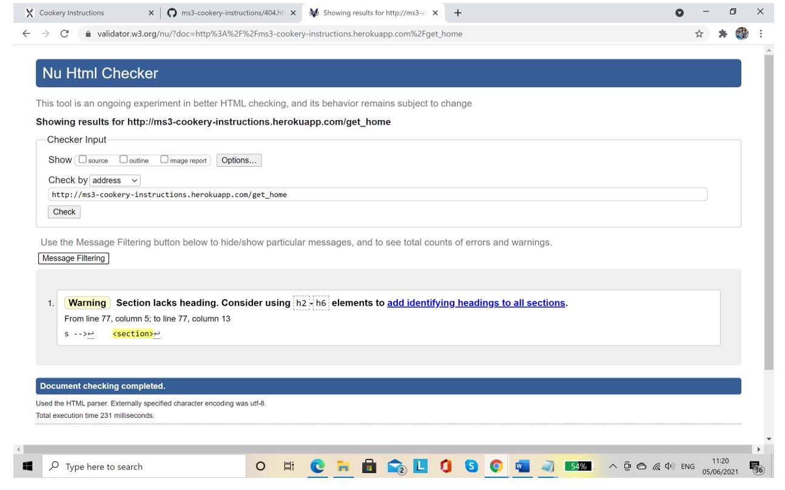
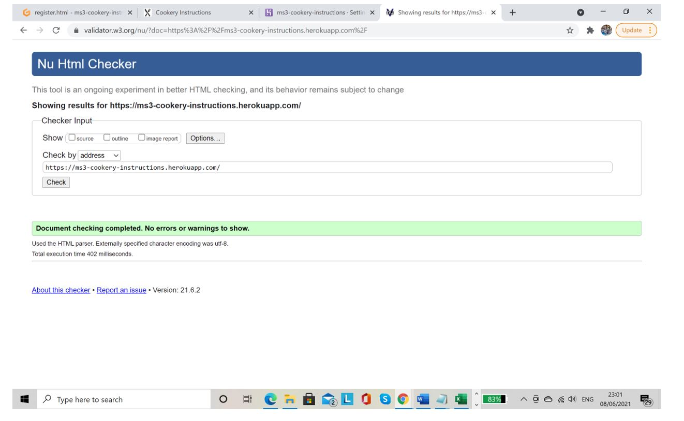
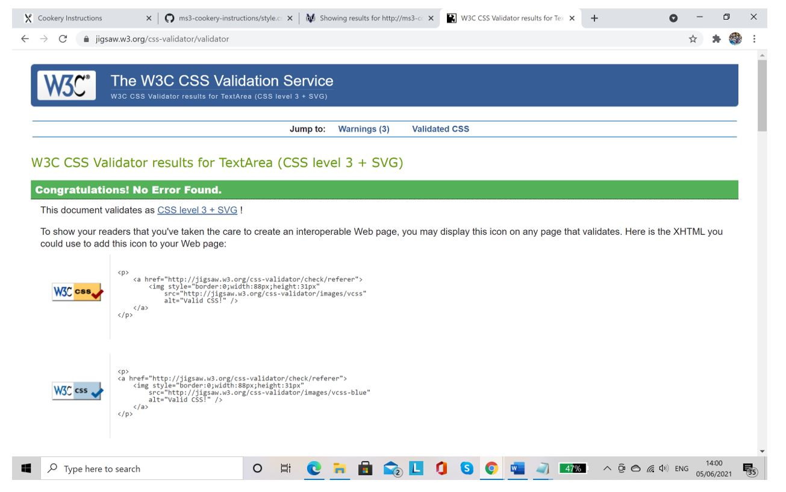
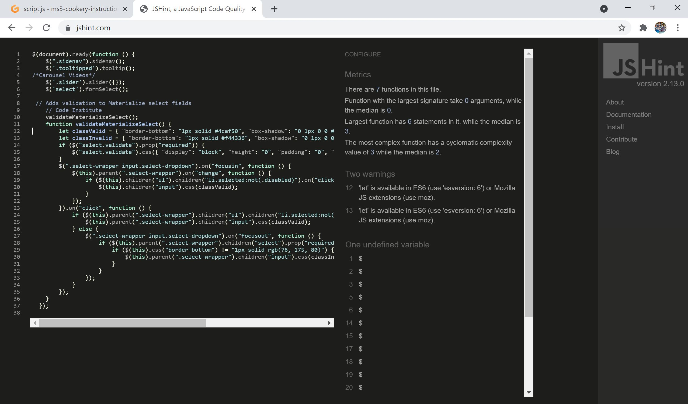
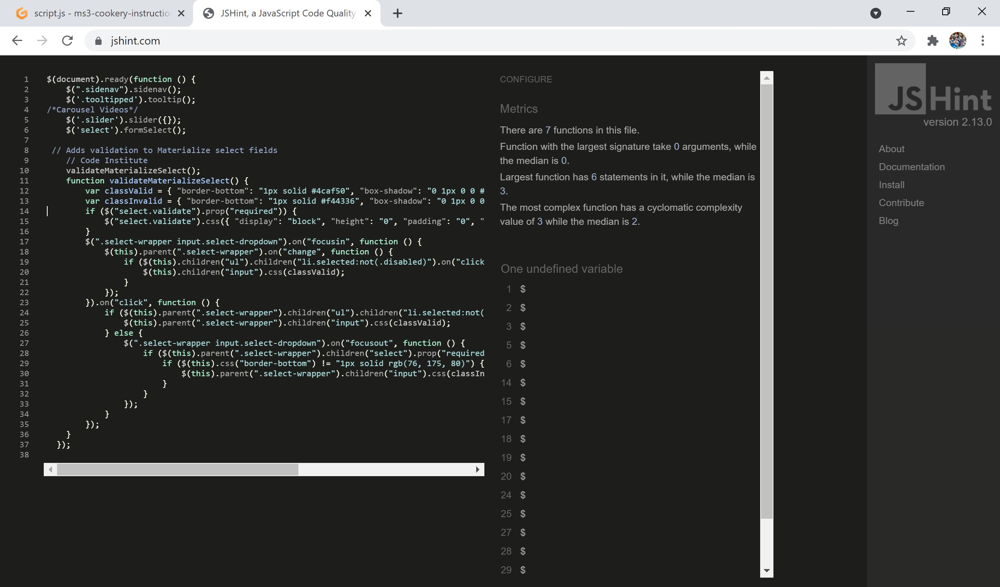
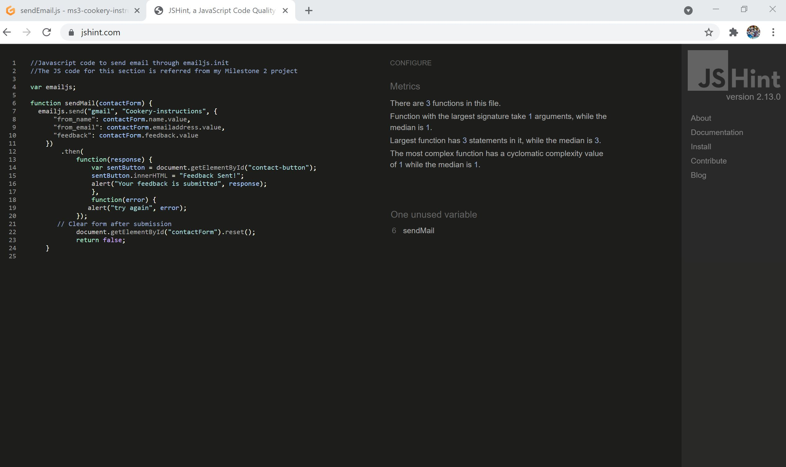
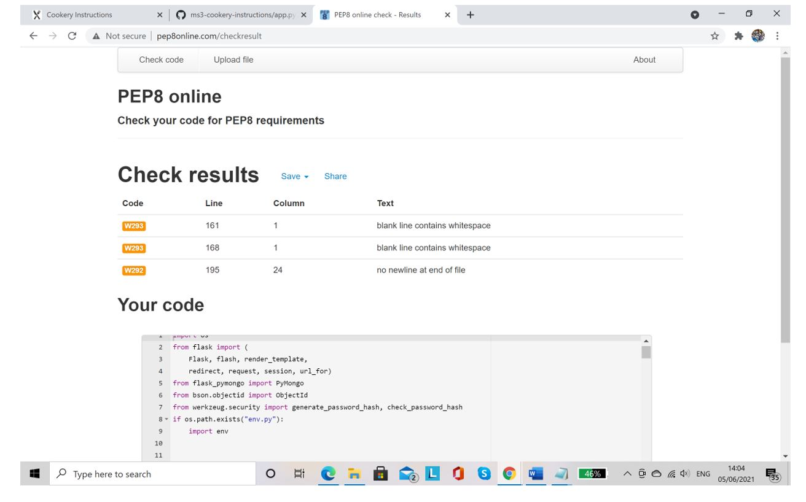
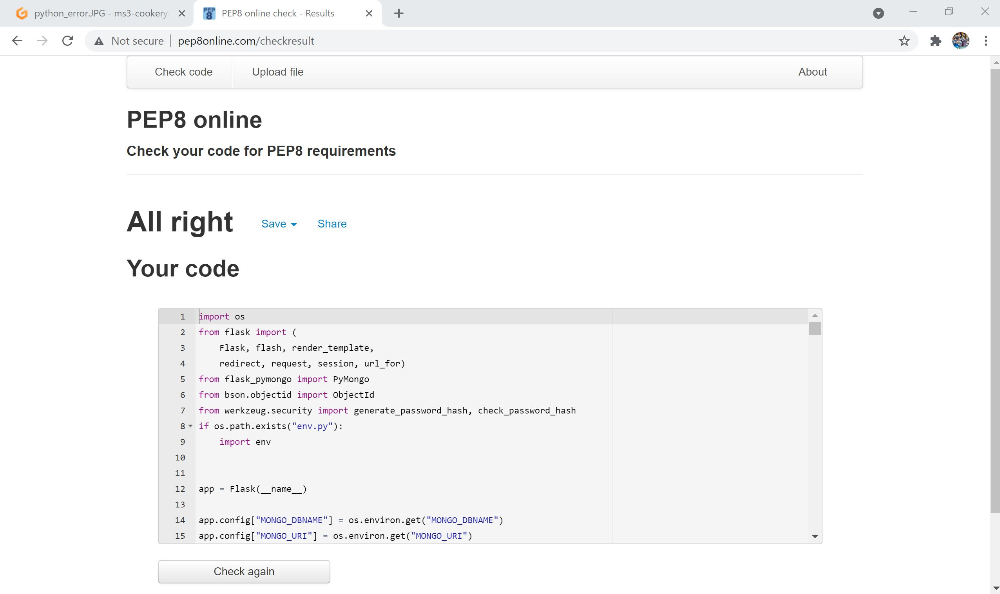
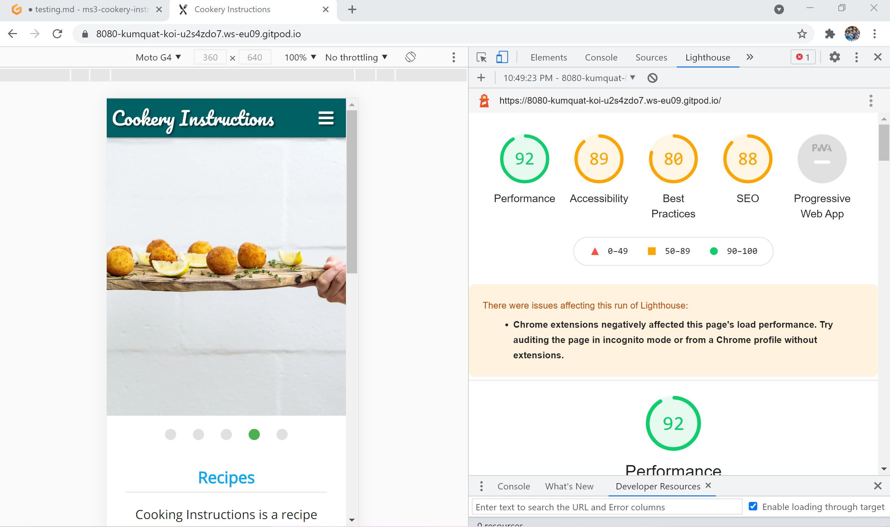

#  Testing page for Cookery Instructions

### An online cookery Instructions Website created by Vijayalakshmi Dhandapani.

[Main README.md file](README.md)

[View live site here](https://ms3-cookery-instructions.herokuapp.com/)

## Testing Table of Contents

* [Code Testing](#code-testing)
    * [Markup](#markup)
    * [CSS](#css)
    * [Javascript](#javascript)
    * [Python](#python)

* [User Stories Testing](#user-stories-testing)

* [Manual Testing](#manual-testing)

    * [Elements on every page](#elements-on-every-page)
       * [Navigation Bar](#navigation-bar)
       * [Footer](#footer)
       * [Flashed messages](#flashed-messages)
    * [Elements on separate page](#elements-on-separate-page)
       * [Home Page](#home-page)
       * [Recipe Page](#recipe-page)
       * [Add Recipe Page](#add-recipe-page)
       * [Edit Recipe Page](#edit-recipe-page)
       * [Delete Recipe](#delete-recipe)
       * [Profile Page](#profile-page)
       * [Manage Category Page](#manage-category-page)
       * [Support/Feedback Page](#support-feedback-page)
       * [Login Page](#login-page)
       * [Sign up Page](#sign-up-page)
       * [Error Handler](#error-handler)

* [Responsiveness](#responsiveness)

* [Browser Compatibility](#browser-compatibility)

* [Lighthouse](#lighthouse)

* [Debugging](#debugging)

***

## **Code Testing**

### **Markup**
 [W3C Markup Validation Service](https://validator.w3.org/)

   * W3C markup validation service is used for the testing of the **HTML** of all  HTML pages and the initial result was this.

  So, the section is removed. The final result is this

### **CSS**

[W3C CSS Validation Service](https://jigsaw.w3.org/css-validator/)

* W3 CSS validation service is used for the testing of the **CSS** of the project and the result is here.
 

 ### **Javascript**

[JSHint](https://jshint.com/)

* JSHint, a JavaScript code quality tool was used to test the **JavaScript** codes of all 2 js pages from the project. While running script.js getting some warnings were displaying, that "let" is available in ES6 or use Mozilla extension. So I replaced all let  variables by "var" again running getting warning using $ sign and can be ignored. While running sendEmail.js file getting one unused variable which can be ignored.

   
  
  

### **Python**
[Python Validator](http://pep8online.com/)

 While running the python code getting error like blank like contain white space and no newline at end of the file. So rectified that error and the result can be seen here.

 
 

***

## **Client Stories Testing**

Testing client stories from UX part of [README.md](README.md) 
 
1. As a user, I want to be able to easily find the favourite dishes that I am looking for.
    * This website has given a online recipe of different varieties.
    * The recipe  is situated on the navbar or click recipe button from home page, below the slide images. 

2. As a user, I want to search the dishes by using simple words.
    * The keyword to function in the search engine is any word from the recipe title.

3. As a user, I want to select dishes by their appearance.
    * The Recipe page has card displayed, but they don't show the full details of that recipe.
    * The Recipe card show only Image and name of that recipe.
    * When someone wants know the method of recipe while click on the image will go to the recipe detail page.
   
4. As a user, I want to know the ingredients, method and cooking instruction for specific dishes.
    * The recipe detail page display the full details of recipe 
    * That page contains Image of specific dish, Name , Serves, Time taken, Ingredients , Method and added by.
    
5. As a user, I want to contact the admin of the page if I am facing some technical issues.
    * A support/feedback form is given with the site, the link of which can be found in the Navbar also in home page.
    * This contact form has a Name, Email and Feedback session so that users can give anything in feedback.
    
6. As a user, I want to register or sign up my account and able to add their own recipes.
    * The link to the Registration form is given in the Navbar and also in home page, which is visible to anyone who is visiting the site.
    * The Registration form clearly states the conditions to Register as, Username and Password must be 5-15 characters long, with only numbers and letters.
    
7. As a registered user, I want to login my account and make some changes to my recipes.
    * The login form is given in the Navbar also in home page, so it is easy to find the Log In page.
    * After Logging the user is directed to the profile page which shows all the recipes posted by the user.
    * User can see Edit and Delete button to make some changes.
    * When the user clicks image of the recipe card, it opens in full details of dishes.
    * After clicking the edit button, the user is directed to edit recipe page, where the user can make any changes.
    * After clicking the delete button, the user can delete the recipe easily.

8. As a registered user, I want to login my account and add another recipes.
    * The login form is given in the Navbar also in home page, so it is easy to find. 
    * After Logging in the user is directed to the Profile Page which shows all the recipes posted by the user.
    * By using Add Recipe button which is display after Navbar, user can add their own recipe in easy way.

9. As a registered user, I want to login my account and remove my recipes.
    * The login form is given in the Navbar also in home page, so it is easy to find. 
    * After Logging in the user is directed to the Profile Page which shows all the recipes posted by the user.
    * After clicking the delete button , the user can delete the recipe easily.

10. As a registered user, I want to login from mobile or tablets and expect the site and image to be fully responsive.
    * The site is fully responsive in mobile and can be easily navigated through the Navbar
    * The Navbar in mobile view is collapsible and opens in the sidebar

11. As a registered user, I want to logout easily.
    * After Logging user can see Logout link on the navbar.
    * By clicking the Logout tab user can easily log out and direct to Login page.

[Go to Top](#testing)
***

## **Manual Testing**

**Manual Testing of all elements and functionality of every page.**

#### **Navigation Bar**

1. Check if the **navigation bar** has a Brand Name and Menu.
2. Click the Brand name, check if the **Home** page opens.
3. Click the **Home** link, check if the page stays on the home page.
4. Click the **Recipe** link, check if the recipe page opens.
5. Click the **Login** link, check if the Login page opens.
6. Click the **sign Up** link, check if the Register/Sign up page opens.
7. Click the **Support/Feedback** link, check if the Support/Feedback page opens.
8. Log in to the site, Check If **Profile**, **Add Recipe**, and **Logout** link are visible.
9. Click the **Profile** link, check if the Profile page opens.
10. Click the **Add Recipe** link, check if the Add recipe page opens.
11. Click the **Logout** link, check if the user logs out, and Log in page opens.
12. Log in from the Admin's account, Check if the **Manage Categories** link is visible.
13. Click the **Manage categories** link, check if the Manage Categories page opens.
14. Check for **Responsiveness** in mobile view, the navigation bar collapsed in the hamburger icon.
15. Check in the mobile view if the menu is opening in the sidebar. 
16. Repeat steps from 2 to 12 in mobile view.

#### **Footer**

1. Check the **Footer** is always fixed at the bottom of the page.
2. Click the **Instagram** link, check if it opens my Instagram login page on a different tab.
3. Click the **YouTube** link, check if it opens the youtube login page on a different tab.
4. Click the **Facebook** link, check if it open the Facebook login page on a different tab. 
5. Check the copyright display.
6. Go to the mobile view and check for **responsiveness**.
7. Repeat steps 1 to 4 in the mobile view.
 
#### **Flashed Messages**

1. Register with a new account and check if the flash message **"Registration Successful"** appears.
2. Register with already register username and check if the flask message **"Username already exists"** appears.
3. Log in to the site and check if the flash message **"username's profile"** appears.
4. Log in with an incorrect account and check if the flash message **"Incorrect Username or Password"** appears.
5. Logout from the session and check if the flash message **"You have been Logged Out"** appears.
6. Add some Recipe and check the flash message **"Recipe Added"** appears.
7. Edit some recipe card and check for the flash message **"Recipe Updated"** appearance.
8. Delete some recipes and check if the flash message **"Recipe Successfully Deleted"**  appears.
9. Log in from Admin account and add some category, check if the flash message **" New category Added"** appears.
10. Edit some categories and check if the flash message **"Category successfully updated"** appears.
11. Delete some categories and check if the Flash message **"Category successfully deleted"** appears.
12. Send some feedback through the Contact form and see if the flash message **"Your feedback is submitted"** appears.

### **Home Page**

#### **Slide Image**

 1. Check the slide images are loading fine and is always on top of the Home page.
 2. Check for **Responsiveness** on different screen sizes.

#### **Content of Home page**

  1. Check for the fonts, and is readable with the dark background.
  2. Check for the Grammatical mistakes if any, in the text written.
  3. Check for **Responsiveness** on different screen sizes.

### **View Recipe Page**

#### **Search Bar**

 1. Check the search bar is loading correctly on the Recipe page.
 2. Type any random word and click the search button, the result is showing below the search bar.
 3. Type any word which has not related to the recipe page like- "sample", then "No Result Found" should flash below the search bar.
 4. Click the orange refresh button and the page should be refreshed and all the recipes should appear.
 5. Go to mobile view and repeat steps 1 to 4.

 ### ** Recipe Page**

 1. Check for the positioning of the recipe cards, it is well-aligned.
 2. Check for the image sizing of the cards, all images are equal in size.
 3. Check for the title of the recipe will display below the image.
 4. Click on the card, it opens on a new page.
 5. Go to the mobile view and repeat steps 1 to 4.

### **Profile Page**

 1. Log in through any user profile who has added any recipes or Admin's profile.
 2. A Welcome message with username appears.
 3. All the recipes posted by the user are visible on the page, like the recipe page.
 4. Logout and then log in again with the same username or different user.
 5. Add recipe button will direct to add the recipe.
 6. Go to mobile view and repeat steps 1 to 5.

#### **Add Recipe**

 1. Check the Add recipe form is fully responsive and covers half the page in medium to large screen size.
 2. Check the fields in recipe form display correctly in all screens(medium, small and large).
 3. Check for the responsiveness for the images.

 #### **Edit Button**

 1. Log in with a username, who has added any recipe, or with an admin profile.
 2. Check the Edit button is showing on the bottom of the recipe image View in profile page.
 3. Click the Edit Button, It opens the Edit recipe page.
 4. Go to the Mobile view, the button is visible there and working fine.

#### **Delete Button**

 1. Log in with a username, who has added any recipe, or with an admin profile.
 2. The delete button should be there on the bottom of the recipe image view in profile page.
 3. Click the Delete button, delete the entire recipe and the user is directed to the recipe page.
 
 ### **Manage Category Page**

 1. Log in with Admin's profile, The **manage Category** link should be there on the Navbar.
 2. Click that and Manage category page opens.
 3. Click the **Add Category** button on the top, Add Category Page opens.
 4. Add any category, and click the Add Category button, The new category gets added with a flash message that **New category added** and the user is directed to the Category page.
 5. On the Category card, click the Edit button, the edit category page opens, with the existing category name already there.
 6. Make some changes and click Edit, user gets directed back to manage Category page with message **category successfully Updated**.
 7. Click the Cancel and User directed back to Manage Category page.
 8. Click the Delete button on the Category Card, delete the entire category with a flash message **Category Successfully Deleted**.
 9. Go to the mobile View and repeat steps 1 to 9.

 ### **Sign Up Page**

 1. Check the Username section, check if it allows entering after following the pattern.
 2. Try to enter something, not in the pattern, the sections turn red and the message also turns red, which says "Username and Password must be
    5-15 characters long, with only numbers and letters"
 3. Repeat this with the password.
 4. Click the Register button, profile Page gets open with a "Registration Successful" message.
 5. Check the small text below the form, click the log in link, and the Login form gets opens.
 6. Repeat the steps with the Mobile view. 

 ### **Contact Us Page**

 1. Check spelling and content in the form.
 2. Check the **Full Name** section and the form, check if it allows writing.
 3. Check in the **Email** section, check if it gives a message when the email format is not correct.
 4. Write some text in the **Feedback** area, check if it allows writing more than 3 lines.
 5. Click the **Submit** button, check if the email is received in the recipient email address.
 6. Click the submit button, message appear like **Your feedback is submitted** after click ok button, and submit button text changes to `"Feedback Sent"`.
 7. Go to Mobile view and repeat steps 1 to 6.

 ### **Error Handler**

 1. On the live Heroku app , type something (which is not the name of any page of the site) in the URL .
 2. Press enter and 404 image will show. 
 3. Click to the word "Cookery Instructions" and the user is back to the Home page.

  [Go to Top](#testing)
***

## **Responsiveness**

 * DevTools- Devices tested across a range of widths: iPhone5(320px)| Samsung S5(360px)| iPhone6/7/8/X(375px)| iPhone6/7/8 Plus(414px)| iPad(768px)| iPad Pro(1020px)| Laptop(1200px)| Large Desktop Screen(1920px)
 * Viewed site on above range on various browsers: Google Chrome, Firefox.
 * Viewed on physical devices: small phone(320px)| Large phone(414px)| large tablet(768px)| medium, laptop(1366px)| Large Desktop Screen(1920px)

## **Browser Compatibility**

### **Desktop / Laptop**

 **Google Chrome** - All tested and working correctly.

 **Microsoft Edge** - All tested and working correctly.

 **Mozilla Firefox** - All tested and working correctly.

 
### **Tablet**

 **Google Chrome** - All tested and working correctly.

### **Mobile**

 **Google Chrome** - All tested and working correctly.

  **Samsung Internet** - All tested and working correctly.

[Go to Top](#testing)
***

## **Lighthouse**
 * The Lighthouse testing done and score are below.

   

[Go to Top](#testing)
***

## **Debugging**

The following details any issues I came across which are now resolved, for reference:

 * Displaying the recipe ingredients/method on separate lines: to get each ingredient/step to display on a separate line, I used splitlines in my jinja code, and prompted the user to enter each ingredient/step on the input form

 * Delete the recipe was not working . I had mistake on write **mongo.db.recipes.remove({"id": ObjectId(recipe_id)})** instead of **mongo.db.recipes.remove({"_id": ObjectId(recipe_id)})** now its working fine.

 The following details of issues which remain unsolved:

 * Support/Feedback tab will not display while user logging In.
 * If user logging In they can not edit / delete their recipe on recipe page.
 * Adding a recipe involves inputting a URL, there is no option to upload a file.

[Go to Top](#testing)
***